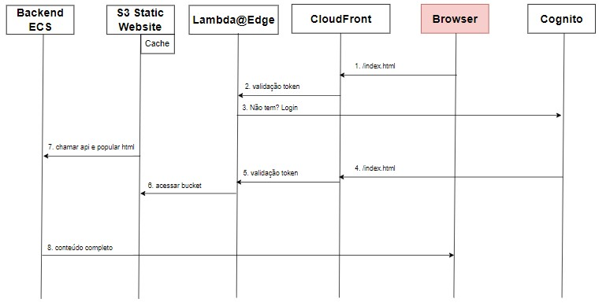

## Choose the language

- [README in english](README.md)
- [README in portuguese](README_pt.md)

# 1 - Complete architecture
This repository only contains the backend and static files of an application hosted on AWS. It is a simple **POC** that, from the AWS Textract product, receives a photo of an ID and searches for the name, date of birth and ID number, saving it in the RDS/Postgres database. It's also on Gitlab.


- The goal was to implement cloud implementation, IaC and CI/CD knowledge while studying for Solutions Architect.

## 2 - Pre-requisites
- To run the backend, you need to pass the following environment variables to the application or to the container of this repository if you build it: AWS_ACCESS_KEY_ID, AWS_SECRET_ACCESS_KEY, RDS_URL, RDS_USERNAME, RDS_PASSWORD

## 3 - Run the backend
```bash
docker build -t textract -p 8080:8080 .
docker run -p 8080:8080 --env-file=.env textract
```

## 4 - Current state
- Due to the completion of the free tier for some of these components in my account, I closed access to this application/bucket, but the development and some components can be found here:

## 5 - Infrastructure
- The backend infrastructure was made using Terraform, which is in another repository. This repository in question is used for CI/CD, which will be mentioned in topic 8. Thus, with each incremented version in the pom.xml, a new version is generated, and a redeploy in the ECS is forced. The infrastructure of the other components was made by the AWS console.
- The repository that contains the infrastructure of this POC is another project of mine:
    - [raquelvaladao/ecs-fargate-private-registry-module](https://github.com/raquelvaladao/ecs-fargate-private-registry-module)

## 6 - Authentication
- Using a Cognito pool, the Login, Authorize, and Token APIs, and Google's OAuth2, I used a third-party library, [awslabs/cognito-at-edge](https://github.com/awslabs/cognito-at-edge), as a Lambda@Edge function attached in the CloudFront distribution to handle the calls.


- The complete flow of a call:





    1. User calls *front.domain.xyz*.
    2. The Lambda function verifies that there are no valid cookies with a bearer token and forwards the call to *auth.domain.xyz*
    3. After login, Cognito's redirect url is *front.domain.xyz*.
    4. The lambda function runs again and now there are valid cookies, freeing up the call to the static website. Static files fetch the cookie bearer, which can be sent to the backend.
## 8 - CI/CD
- There is a *.gitlab-ci.yml* file in that repository, because it was [officially on Gitlab](https://gitlab.com/raquelvaladao/texttract-app). It's a 3-stage pipeline that 1-builds, 2-lints the dockerfile, 3-deploys to ECS using the terrafiles from the topic 5 repository. 
- Deploy stage:
```yaml
...

deploy:
  stage: deploy
  image:
    name: hashicorp/terraform:light
    entrypoint:
    - '/usr/bin/env'
    - 'PATH=/usr/local/sbin:/usr/local/bin:/usr/sbin:/usr/bin:/sbin:/bin'
  variables:
    IAC_REPOSITORY: https://github.com/raquelvaladao/ecs-fargate-private-registry-module
    SECURE_FILES_DOWNLOAD_PATH: .secure_files
  before_script:
    - apk add curl git bash
    - git clone ${IAC_REPOSITORY} && cd $(echo "${IAC_REPOSITORY}" | awk -F'/' '{print $NF}') && git checkout remote-backend
    - curl --silent "https://gitlab.com/gitlab-org/incubation-engineering/mobile-devops/download-secure-files/-/raw/main/installer" | bash
    - export TAG="$(cat target/VERSION)"
    - export TV_VAR_image_version="${TAG}"
  script:
    - terraform init -backend-config=${SECURE_FILES_DOWNLOAD_PATH}/backend.conf
    - terraform plan
    - terraform apply -auto-approve
```

## 8 - Example
- A mock up of an identity document having its text extracted


