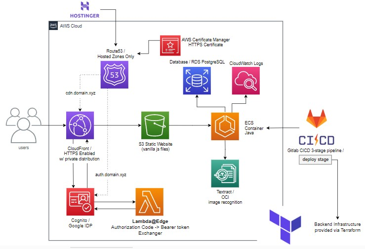
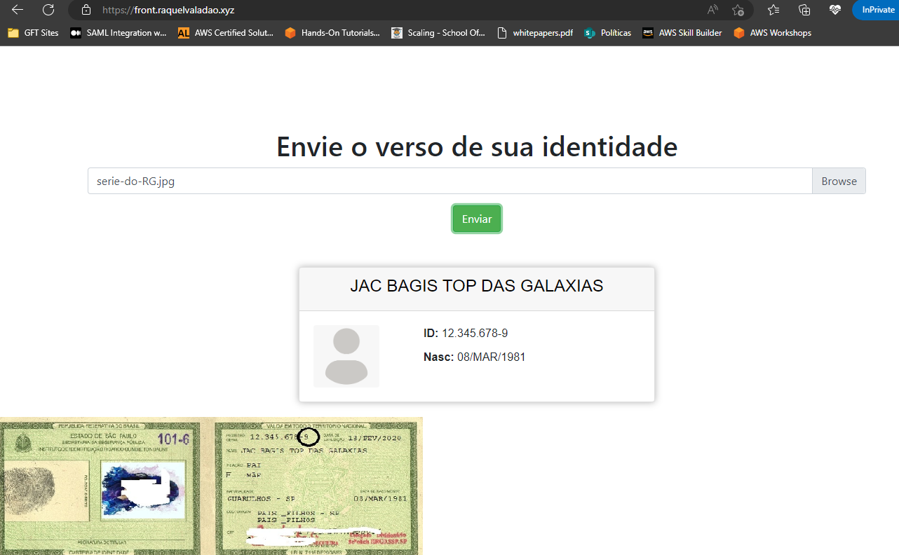

## Escolha a linguagem

- [README em inglês](README.md)
- [README em português](README_pt.md)

# 1 - Arquitetura completa
Esse repositório contém somente o backend e arquivos estáticos de uma aplicação hospedada na AWS. É uma **POC** simples que, a partir do produto Textract da AWS, recebe a foto de uma identidade e procura pelo nome, data de nascimento e número do RG, salvando-o no banco RDS/Postgres. Também está no Gitlab.





- O objetivo era implementar conhecimentos de implementação em núvem, IaC e CI/CD.

## 2 - Pré-requisitos
- Pra rodar o backend, É preciso passar as seguintes variáveis de ambiente para aplicação ou para o container desse repositório caso faça o build : AWS_ACCESS_KEY_ID, AWS_SECRET_ACCESS_KEY, RDS_URL, RDS_USERNAME, RDS_PASSWORD

## 3 - Rodar o backend
```bash
docker build -t textract -p 8080:8080 .
docker run -p 8080:8080 --env-file=.env textract
```

## 4 - Estado atual
- Devido à finalização do free tier para alguns desses componentes, fechei o acesso a essa aplicação/bucket, mas o desenvolvimento e alguns componentes podem ser encontrados aqui:

## 5 - Infraestrutura
- A infraestrutura do backend foi feita utilizando Terraform, que está em outro repositório. Esse repositório em questão é utilizado para CI/CD, o que será mencionado no tópico 8. Assim, a cada versão incrementada no pom.xml, é gerada uma nova versão, e força-se um redeploy no ECS. A infraestrutura dos demais componentes foi feita pelo console da AWS. 
- O repositório que contém a infraestrutura dessa POC é um outro projeto meu:
    - [raquelvaladao/ecs-fargate-private-registry-module](https://github.com/raquelvaladao/ecs-fargate-private-registry-module)

## 6 - Autenticação
- Utilizando um pool do Cognito, as APIs de Login, Authorize e Token, e OAuth2 do Google, utilizei uma biblioteca de terceiros, [awslabs/cognito-at-edge](https://github.com/awslabs/cognito-at-edge), como função Lambda@Edge atachada na distribuição do CloudFront para lidar com as chamadas.


- O fluxo completo de uma chamada:


    1. O usuário chama *front.domain.xyz*.
    2. A função Lambda verifica que não há cookies válidos com um bearer token e encaminha a chamada para *auth.domain.xyz*
    3. Após o login, a url de redirect do Cognito é *front.domain.xyz*.
    4. A função lambda roda novamente e agora há cookies válidos, liberando a chamada para o site estático. Os arquivos estáticos buscam o bearer do cookie, que pode ser enviado para o backend.
## 8 - CI/CD
- Há um arquivo *.gitlab-ci.yml* nesse repositório, porque ele estava [oficialmente no Gitlab](https://gitlab.com/raquelvaladao/textract-app). É uma pipeline de 3 estágios que 1-faz build, 2-faz lint do dockerfile, 3-deploy no ECS usando os terrafiles do repositório do tópico 5. 
- O stage de deploy:
```yaml
...

deploy:
  stage: deploy
  image:
    name: hashicorp/terraform:light
    entrypoint:
    - '/usr/bin/env'
    - 'PATH=/usr/local/sbin:/usr/local/bin:/usr/sbin:/usr/bin:/sbin:/bin'
  variables:
    IAC_REPOSITORY: https://github.com/raquelvaladao/ecs-fargate-private-registry-module
    SECURE_FILES_DOWNLOAD_PATH: .secure_files
  before_script:
    - apk add curl git bash
    - git clone ${IAC_REPOSITORY} && cd $(echo "${IAC_REPOSITORY}" | awk -F'/' '{print $NF}') && git checkout remote-backend
    - curl --silent "https://gitlab.com/gitlab-org/incubation-engineering/mobile-devops/download-secure-files/-/raw/main/installer" | bash
    - export TAG="$(cat target/VERSION)"
    - export TV_VAR_image_version="${TAG}"
  script:
    - terraform init -backend-config=${SECURE_FILES_DOWNLOAD_PATH}/backend.conf
    - terraform plan
    - terraform apply -auto-approve
```

## 8 - Exemplo
- Um mock de uma identidade tendo seu texto extraído


